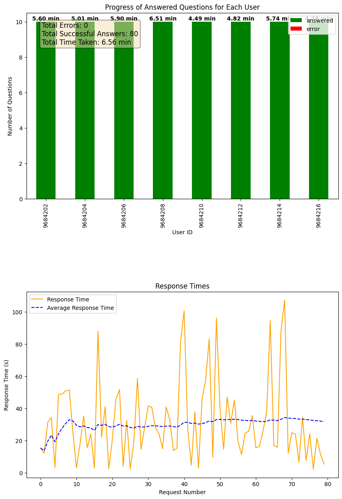

1. Activate environment: .\.venv\Scripts\activate

2. run pip install -r requirements.txt

3. to avoid complaining about SSL certificate run the following command to install dependencies:
(.venv) PS C:\Users\W513032\source\repos\volume testing> pip install --trusted-host pypi.org --trusted-host files.pythonhosted.org -r requirements.txt

Here's the step-by-step description of the code and the improvements made:
Volume Testing Simulator for LLMs
This script performs volume testing on a Large Language Model (LLM) using AWS Bedrock. It simulates multiple users asking a series of questions to the LLM and measures the performance and response times. The results are plotted and analyzed to provide insights into the performance of the LLM and saved to an Excel file.

Main Components:
Environment Setup:

Sets the AWS profile and certificate bundle required for making secure requests to the AWS Bedrock service.
File Validation:

validate_file(file_path): Validates if the provided file is a readable Excel file and returns the number of rows.
Bedrock Client Initialization:

initialize_bedrock_client(): Initializes the AWS Bedrock client using boto3.
Chat Function:

chat(question): Sends a question to the LLM and returns the response.
Simulate User Questions:

simulate_user_questions(user_id, questions, question_ids, user_progress, user_time, response_times, avg_response_times, error_log, lock, results): Simulates a user asking a series of questions. It measures the response time and updates the user's progress. Any errors encountered are logged. The results are appended to a list to be saved in an Excel file.
Update Plot:

update_plot(user_progress, user_time, response_times, avg_response_times, error_log): Generates and updates a plot showing the progress of users, response times, and other metrics. The plot is dynamically updated during the execution.
Analyze Results:

analyze_results(user_count, question_count, total_successes, total_errors, total_time_taken, avg_response_times, response_times, error_log): Analyzes the volume test results using the LLM and provides insights into the performance.
Main Execution:

Validates the user and question files.
Reads the data from the validated files.
Initializes necessary data structures for tracking user progress, response times, and errors.
Executes the volume test using multiple threads to simulate concurrent users.
Plots and analyzes the results.
Saves the results to an Excel file named volume-test-run-YYYYMMDD-HHMM.xlsx.
Usage:
File Requirements:

wex-users.xlsx: An Excel file containing user details. The first column should be user-id.
wex-questions.xlsx: An Excel file containing questions. The first column should be question-id, and the second column should be Question.
Running the Script:

Ensure the required Python packages are installed.
Set the correct AWS credentials in your environment.
Place the wex-users.xlsx and wex-questions.xlsx files in the appropriate directory.
Run the script to perform the volume test.
Example Output:
The script generates two plots:

Progress of answered questions for each user, including the time taken.
Response times and average response times.
A detailed analysis of the results is printed, providing insights into the performance of the LLM.

The results are saved to an Excel file named volume-test-run-YYYYMMDD-HHMM.xlsx.

for 2 users:

for 3 users:
